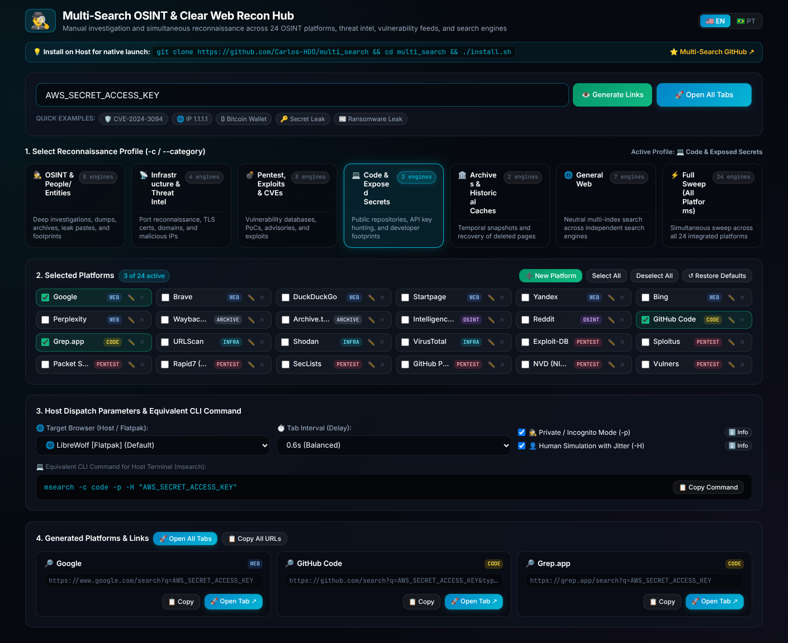

# Multi-Search (`msearch`)

A dual-mode intelligence and reconnaissance suite designed for **OSINT (Open Source Intelligence)**, threat hunting, vulnerability research, and comprehensive web investigations.

It operates seamlessly as both a **fast command-line tool** and an **interactive Web UI Command Center**, firing coordinated queries across 24 specialized intelligence sources, vulnerability databases, code search engines, and web archives directly into your preferred browser (LibreWolf, Firefox, Brave, Chrome, Chromium, or Tor Browser).

---

## 🎯 Key Capabilities

- **🖥️ Dual Mode (CLI & Interactive Web UI)**:
  - **Interactive Web Hub**: Run `msearch` (or `ms`) with no arguments to launch the local Command Center at `http://localhost:7890`.
  - **Direct Terminal Power**: Run `msearch "query"` to immediately dispatch searches from the terminal.
- **⚡ 24 Built-in Intelligence & Security Engines**:
  - General indexes, threat intel databases, code search, historical archives, and exploit repositories.
- **🏷️ Dedicated Intelligence Profiles (`-c` / `--category`)**:
  - `web` *(Default CLI)*: Clean multi-index search across 7 independent engines without profiling.
  - `osint`: Deep investigations, person/entity footprinting, paste/darkweb dumps, and archives.
  - `infra`: Network infrastructure, open ports, certificates, DNS, and threat intelligence.
  - `code`: Public repositories, leaked secrets, exposed tokens, and developer footprinting.
  - `archive`: Historical snapshots and recovery of deleted pages.
  - `pentest` / `exploit`: Penetration testing, exploits, CVEs, security advisories, and PoCs.
  - `all`: Full spectrum sweep across all 24 platforms simultaneously.
- **🛠️ Platform Customization & CRUD**:
  - Add custom search platforms with URL template (`{q}` placeholder), edit, remove, and categorize them.
  - Persistent storage in `~/.config/multi_search/config.json`.
- **🌐 Automatic Browser Detection & Aliases**:
  - Auto-detects Native, Flatpak, and Snap installations (LibreWolf, Firefox, Brave, Chrome, Chromium, Tor Browser).
- **🕵️ Private / Incognito Mode (`-p`)**:
  - Spawns private/incognito windows to prevent tracking and avoid search bias.
- **👤 Human Simulation & Anti-Bot Evasion (`-H`)**:
  - Dynamic jitter (organic pacing 1.0s-2.6s) and shuffled order (`--shuffle`) to bypass Cloudflare/WAF bot detection.

---

## 📦 Requirements & Installation

### Requirements
- **Python 3.8+** (Standard library only — **zero external pip dependencies**).
- At least one supported web browser (LibreWolf, Firefox, Brave, Chrome, Chromium, Tor Browser).

### Quick Installation

Clone the repository and run the installer:
```bash
git clone https://github.com/Carlos-HDO/multi_search.git
cd multi_search
chmod +x install.sh
./install.sh
```

The script creates symlinks in `~/.local/bin/` (`msearch` and `multi_search`).

### Shell Alias (Recommended)

Add a convenient 2-letter alias `ms` to your shell profile:

#### Bash:
```bash
echo "alias ms='msearch'" >> ~/.bashrc && source ~/.bashrc
```

#### Zsh:
```bash
echo "alias ms='msearch'" >> ~/.zshrc && source ~/.zshrc
```

---

## 🖥️ Interactive Web UI Command Center

<div align="center">



*Interactive Command Center with 7 Intelligence Profiles, 24 Search Engines, Platform CRUD, and Live CLI Generator.*

</div>

Simply run `msearch` (or `ms`) with no arguments:

```bash
msearch
```

This starts the embedded local web server and automatically opens `http://localhost:7890` in your default browser.

```
====================================================================
  🕵️‍♂️  MULTI-SEARCH — OSINT Recon Hub & Command Center
  🌐 Servidor local ativo em: http://localhost:7890
  ⚙️  Configuração salva em: ~/.config/multi_search/config.json
  ⌨️  Pressione [Ctrl + C] para encerrar.
====================================================================
```

### Web UI Features:
1. **🌐 Bilingual Interface (EN / PT)**:
   - English default with instant header toggle (`🇺🇸 EN` / `🇧🇷 PT`) and persistent preference.
2. **🏷️ 7 Intelligence Profile Cards**:
   - Aligned engine count badges and bottom-aligned descriptions. Clicking a profile instantly activates its platform set.
3. **🛠️ Platform Management (CRUD)**:
   - `➕ New Platform`: Register custom search platforms with `{q}` query placeholders and custom category tags.
   - `✏️ Edit`: Update URL templates and category assignments.
   - `✕ Remove`: Delete custom or unwanted engines.
   - `Select All` / `Deselect All`: Instant bulk selection controls.
   - `↺ Restore Defaults`: Factory reset back to 24 default platforms.
4. **⚙️ Execution Controls**:
   - Browser selector (Native, Flatpak, and Snap detection).
   - Delay intervals presets (0.3s, 0.6s, 1.2s, 2.0s, 3.0s, 5.0s) and custom second values.
   - Private / Incognito Mode (`-p`) and Human Simulation with Jitter (`-H`) toggles with explanatory info popups.
5. **💻 Live CLI Command Generator**:
   - Generates the exact `msearch` CLI command corresponding to selected GUI parameters with a one-click copy button.
6. **🚀 Direct OS-Level Launching**:
   - `🚀 Open All Tabs` triggers background browser execution natively on the host operating system.

---

## ⚡ Direct CLI Usage & Examples

### 1. Default Web Search (`web` profile)
When querying without category flags, `msearch` defaults to the **`web`** profile (7 unprofiled engines):
```bash
# Searches: Google, Brave, DuckDuckGo, Startpage, Yandex, Bing, Perplexity
msearch python web scraping
```

### 2. OSINT & Entity Investigations (`-c osint`)
Investigate usernames, handles, people, or organizations across search engines, IntelX leaks, archives, and Reddit:
```bash
msearch -p -c osint "target_username"
```

### 3. Infrastructure & Threat Intel Reconnaissance (`-c infra`)
Query an IP address, domain, or certificate across Shodan, URLScan, VirusTotal, and IntelX:
```bash
msearch -c infra malicious-c2.com
msearch -c infra 1.1.1.1
```

### 4. Code & Leaked Secret Reconnaissance (`-c code`)
Hunt for leaked API keys, tokens, or repository signatures on GitHub Code, Grep.app, and Google:
```bash
msearch -c code "AWS_SECRET_ACCESS_KEY"
msearch -c code "AIzaSy"
```

### 5. Historical Snapshots & Deleted Pages (`-c archive`)
Recover deleted blog posts, social media profiles, or offline websites via Wayback Machine and Archive.today:
```bash
msearch -c archive https://example.com/deleted-article
```

### 6. Pentest, Exploit & CVE Research (`-c pentest` / `-c exploit`)
Search for public exploits, PoCs, CVE details, Metasploit modules, and security advisories across Exploit-DB, Sploitus, Packet Storm, Rapid7 Metasploit, SecLists, GitHub PoC, NVD NIST, and Vulners:
```bash
# Research exploits for a software version
msearch -c pentest "vsftpd 2.3.4"

# Research a specific CVE across exploit databases and PoC repos
msearch -c exploit "CVE-2024-3094"

# Query specific exploit platforms directly
msearch -e exploitdb,sploitus,packetstorm "OpenSSH 8.2"
```

### 7. Surgical Engine Targeting (`-e` / `--engines`)
Target specific platforms using shortcuts (`shodan`, `vt`, `intelx`, `edb`, `sploit`, `ps`, `msf`, `poc`, etc.):
```bash
# Threat intel lookup on an IP
msearch -e shodan,urlscan,virustotal 185.220.101.5

# Privacy search
msearch -e brave,startpage,duckduckgo "zero-day vulnerability"
```

### 8. Choosing a Browser (`-b` / `--browser`)
Specify any installed browser or alias:
```bash
# Use Brave Browser (Flatpak or Native)
msearch -b brave -c osint target-handle

# Use Firefox in private mode
msearch -b firefox -p -c infra target-domain.com

# Use Google Chrome
msearch -b chrome kubernetes security
```

### 9. Human Simulation & Anti-Bot Evasion (`-H` / `--human`)
Mitigates search engine CAPTCHAs and WAF blocks (Cloudflare, Akamai) by:
1. Applying dynamic jitter variance (**1.0s to 2.6s** per tab).
2. Shuffling tab dispatch order (**`--shuffle`**) to break predictable request fingerprints.
3. Allocating an organic initial startup delay (**~2.2s**) for the browser window.

```bash
# Full human simulation:
msearch -H -c osint "target username"

# Custom delay and jitter variance:
msearch -d 1.5 -j 0.8 --shuffle -c infra target-domain.com
```

> [!TIP]
> **Anti-CAPTCHA Best Practices:**
> - Avoid running consecutive bulk searches in private/incognito mode (`-p`), as cold sessions with zero cookie history are flagged more aggressively by anti-bot systems.
> - Running `msearch` on your primary daily browser with legitimate cookies in combination with `-H` significantly reduces verification challenges.

### 10. Preview URLs Without Opening Browser (`--dry-run`)
```bash
msearch --dry-run -c osint "target keyword"
```

### 11. System Discovery Commands
```bash
msearch --list-categories  # View available category presets (-c)
msearch --list-engines     # View all registered search engines (-e)
msearch --list-browsers    # View detected installed browsers (-b)
```

---

## 🛠️ Command-Line Options Reference

| Flag | Argument | Description |
| :--- | :--- | :--- |
| `QUERY` | `[string...]` | Search query (quotes optional; multiple words joined automatically) |
| `--ui`, `--web` | None | Launch the interactive Web UI Command Center in browser |
| `-c`, `--category` | `<name>` | Category preset: **`web` (default)**, `osint`, `infra`, `code`, `archive`, `pentest`, `exploit`, `all` |
| `-e`, `--engines` | `<list>` | Comma-separated list of engines/shortcuts (e.g. `shodan,vt,intelx,edb`) |
| `-b`, `--browser` | `<alias\|cmd>` | Browser alias (`librewolf`, `brave`, `chrome`, `firefox`, etc.) or raw command |
| `-p`, `--private` | None | Open search in a new private/incognito window |
| `-H`, `--human` | None | Simulate human pacing: random delay intervals (1.0s-2.6s) & shuffled order |
| `--shuffle` | None | Randomize the opening order of search engine tabs |
| `-j`, `--jitter` | `<sec>` | Add random variation (±SECONDS) around tab delay intervals (e.g. `-j 0.8`) |
| `-d`, `--delay` | `<sec>` | Delay in seconds between opening tabs (default: `0.3s`) |
| `--initial-delay` | `<sec>` | Delay before opening tabs to allow window startup (default: `1.0s`) |
| `--dry-run` | None | Preview formatted URLs in terminal without launching browser |
| `-lc`, `--list-categories`| None | Display available category presets and exit |
| `-l`, `--list-engines` | None | Display all supported search engines and exit |
| `-lb`, `--list-browsers` | None | Scan and list detected installed web browsers and exit |
| `-h`, `--help` | None | Display help and usage instructions |

---

## 📁 Configuration File

All custom search engines, updated profiles, and configuration options are persisted in:

```
~/.config/multi_search/config.json
```

Any changes made via the Web UI are instantly available in both the Web UI and the CLI tool.

---

## 🔒 Security Model

The Web UI Command Center runs a small local server that can launch browsers on your machine, so it is locked to the host that started it:

- Binds to `127.0.0.1` only (never exposed to the network).
- Rejects (HTTP 403) any request with an external `Origin` (anti-CSRF) or a mismatched `Host` header (anti-DNS-rebinding), so other websites open in your browser cannot drive it.
- The `/api/launch` endpoint only accepts a **known browser alias or an installed browser command** — arbitrary commands are refused (HTTP 400) and never reach the OS.

---

## 🧪 Testing

The project ships a standard-library test suite (no external dependencies):

```bash
python3 -m unittest discover -s tests -v
```

It covers the pure helpers (URL building, delay jitter bounds, alias/category resolution) and the security hardening (cross-origin rejection, DNS-rebinding rejection, and refusal of arbitrary browser commands).

---

## 📄 License

Distributed under the [GNU General Public License v3.0](LICENSE) (GPL-3.0). Free and open source forever. Copyright (c) 2026 Carlos Dias.
